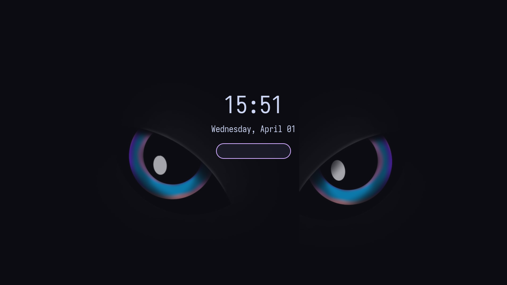

# x11lock

Secure X11 screen locker written in Rust.

`x11lock` creates fullscreen lock windows on every monitor, grabs keyboard and pointer input, and unlocks through PAM authentication.

## Features

- PAM authentication
- Multi-monitor support through RandR
- Fullscreen lock windows always stacked on top
- Keyboard and pointer grab while locked
- Clock and date rendered on screen
- Wallpaper background with solid-color fallback
- Lightweight poll-based event loop
- Password dots and error feedback

## Keyboard input support

Keyboard input handling is intentionally minimal for now.

- Printable ASCII input is supported
- `Shift` is supported for the current simplified key resolution
- Full XKB/group/layout-aware modifier handling is intentionally out of scope for now

This is a deliberate scope decision, not an accidental bug. Broader keyboard/layout
support can be added later once the intended behavior is specified clearly.

## Preview



## Installation

### Option 1: Installer script

```bash
curl -fsSL https://raw.githubusercontent.com/adanft/x11lock/main/install.sh | sudo bash
```

If you prefer to inspect the script before running it:

```bash
curl -O https://raw.githubusercontent.com/adanft/x11lock/main/install.sh
less install.sh
sudo bash install.sh
```

This installs the latest released binary to:

```bash
/usr/local/bin/x11lock
```

### Option 2: Manual install from release

Download the `x11lock` binary from GitHub Releases and copy it to `/usr/local/bin`:

```bash
chmod +x x11lock
sudo mv x11lock /usr/local/bin/x11lock
```

### Option 3: Build from source

```bash
git clone https://github.com/adanft/x11lock.git
cd x11lock
cargo build --release
sudo cp target/release/x11lock /usr/local/bin/x11lock
```

## Usage

```bash
x11lock
```

## Configuration

Right now configuration is intentionally minimal.

### Font

The UI is rendered using:

```bash
IosevkaTerm Nerd Font
```

For the intended appearance, make sure that font is installed on your system.

### Wallpaper

If this file exists:

```bash
~/.config/x11lock/wallpaper.png
```

it will be loaded and scaled for each monitor.

If it does not exist, `x11lock` falls back to a solid background color.

Example:

```bash
mkdir -p ~/.config/x11lock
cp my-wallpaper.png ~/.config/x11lock/wallpaper.png
```

## Requirements

- Linux with X11
- PAM
- A PAM stack compatible with `system-auth`
- Runtime libraries required by the system build (X11, Cairo, Pango)

## PAM service

`x11lock` currently uses this PAM service name:

```text
system-auth
```

This is intentionally defined in the source as a constant for now, not as a runtime
configuration option.

If your distro or PAM setup uses a different service name, change the constant in
`src/auth.rs` and rebuild.

## Security notes

- `x11lock` is an X11 locker, so its security model is limited by X11 itself
- It grabs keyboard and pointer input while running
- It is meant for normal desktop locking usage on X11
- TTY switching is outside the scope of this project

## Notes

- There is currently no CLI configuration interface
- Wallpaper configuration is file-based only: `~/.config/x11lock/wallpaper.png`
- If no wallpaper is present, the locker uses a solid fallback color

## Release workflow

Build the release binary:

```bash
cargo build --release
```

The binary will be generated at:

```bash
target/release/x11lock
```

Upload that file as the release asset named exactly:

```bash
x11lock
```

This is required so `install.sh` can fetch it correctly.
